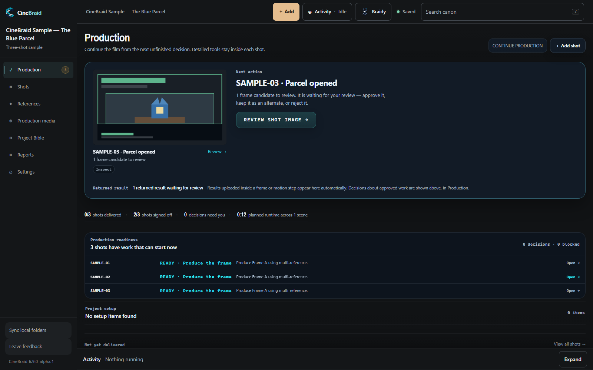
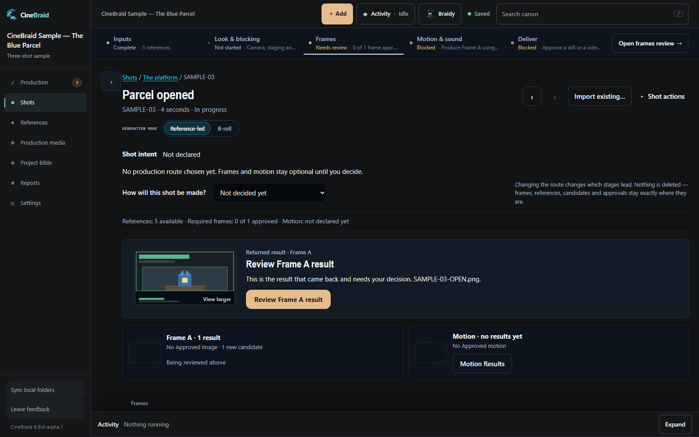
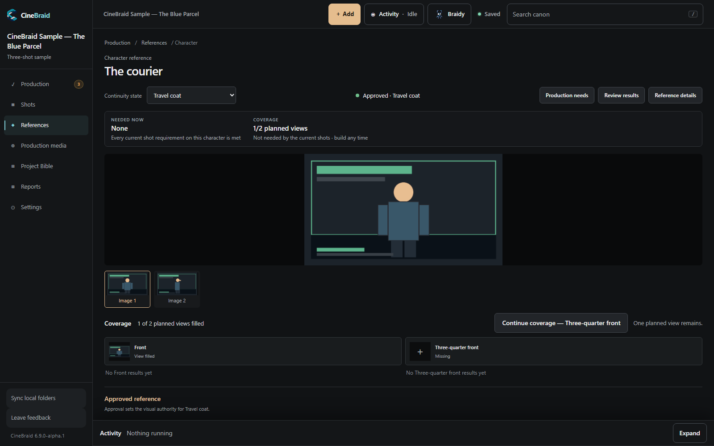

<p align="center">
  
</p>

<h1 align="center">CineBraid</h1>

<p align="center"><strong>Open-source, local-first production software for modern and AI-assisted filmmaking.</strong><br>
Keep your Project Bible, references, shots, and approvals together.</p>

<p align="center">
  <a href="#start">Get started</a> ·
  <a href="#documentation">Documentation</a> ·
  <a href="https://cinebraid.com">Website</a> ·
  <a href="https://github.com/cfbach/cinebraid/issues">Issues</a> ·
  <a href="CONTRIBUTING.md">Contribute</a> ·
  <a href="SECURITY.md">Security</a>
</p>

**Public Alpha released · Source-only · [v6.7.0-alpha.1](https://github.com/cfbach/cinebraid/releases/tag/v6.7.0-alpha.1) · [Apache License 2.0](LICENSE)**

The production layer that keeps AI cinema tied together. **Your production, your control.**

For filmmakers building shorts, music videos, and other multi-shot productions,
CineBraid keeps the work and its production context in one place. Import media
made anywhere, organize the references that must stay consistent, and decide what
to keep. AI assistance and provider-backed generation are optional.

The Public Alpha is **source-only**: there is no binary or native installer.
The product remains **in development**, with rough edges and no production-readiness
or support commitment. The release tag is frozen; ongoing development happens on
`main`.

**Models should be replaceable. The production should not be.**



See the production and the next shot that needs your attention.

## Keep the production together

- **Plan the film.** Organize your Project Bible, scenes, shots, and recurring characters, locations, and props.
- **Carry references forward.** Keep approved looks, views, and continuity states attached to the work that needs them.
- **Review and finish.** Bring in images, video, and audio; compare candidates, approve your choices, and finalize a shot.
- **Choose your tools.** Work entirely by hand, or configure Braidy and supported generation backends when they help.

**Human approval stays explicit.** Nothing is approved, locked, or superseded on
your behalf. A machine can propose; only a person decides. An unavailable provider
does not block the manual workflow.

## See the workflow



Keep each shot connected to its references and chosen frames.



Review a candidate before making an explicit approval.

## Start

Requires **Node.js 18 or newer**; Node.js 24 is the version used by Windows CI.
Check your installation with `node --version`. You also need Git to clone the source.

```bash
git clone --branch v6.7.0-alpha.1 --depth 1 https://github.com/cfbach/cinebraid.git
cd cinebraid
npm ci
npm start
```

This installs the frozen Alpha source in a detached checkout. For post-release
development, clone without `--branch` and `--depth` to follow `main`.

Open the URL printed in the terminal — by default [http://127.0.0.1:4477](http://127.0.0.1:4477).
Set `PORT` if 4477 is taken. Startup also reports the bind address, network posture,
and projects location.

There is **no build step**. `express` is the only npm runtime dependency;
`npm ci` installs it from the lockfile and needs network access. **API keys are
optional:** no credential is needed to install, start, or use the sample.
**ffmpeg is optional** and is not bundled. The server probes for it and reports
its availability for media inspection/proxy utilities; the manual workflow does
not require it.

See [setup and configuration](SETUP.md) for more detail, including upgrades and
running a second isolated installation. For DGX Spark, see [Spark setup](SPARK_SETUP.md).

<details>
<summary>Using a startup script or an archive you built</summary>

`npm run release:build` can create an archive locally. After extracting it, run
`npm ci` in that folder before using `start.bat` on Windows, `start.command` on
macOS, or `./start.sh` on Linux / DGX Spark.

The launchers install with `npm install --silent` only when `node_modules` is
absent. They do not perform the same locked install as `npm ci`; running `npm ci`
first keeps the documented setup reproducible.

</details>

## Try your first shot

The included **CineBraid Sample — The Blue Parcel** is a three-shot project with
simple storyboard media, a courier, a railway platform, and a parcel. It needs no
assistant or generation provider.

1. Open the sample and inspect **References → Approved**.
2. Open **Production → Parcel opened**. In **Frames**, approve the existing `SAMPLE-03-OPEN.png` as Frame A.
3. In **Deliver**, finalize the approved still, then return to Production to see the completed shot.

Follow the [first-shot guide](docs/GETTING_STARTED.md) to practice importing
references, clear the sample's deliberate readiness prompts, and create your own
project. The sample ships inside the application at
[`projects/cinebraid-sample/`](projects/cinebraid-sample/) and stays there, untouched.
**Add the CineBraid sample** on the welcome screen puts an ordinary, editable copy of it
in your own projects folder, so nothing you do to it changes the shipped one.

## Optional assistance and generation

References and Shots remain the production context. Generate when useful, then
Review the returned work before making a human approval.

**Braidy** is CineBraid's optional assistant, with its own rail for planning,
continuity, and prompt help. Configure capabilities under **Settings → Optional
assisted services**. An off or unreachable capability reports its status;
the manual workflow remains available.

| Tool | Where it runs | What you supply |
|---|---|---|
| Braidy with Ollama or an OpenAI-compatible server | Local / self-hosted | A running model server; no cloud API key required |
| Braidy with OpenAI or Anthropic | Cloud | Your provider API key |
| ComfyUI generation | On the same machine as CineBraid | A running ComfyUI server; no provider key or provider charge |
| fal.ai generation | Cloud | Your provider API key |
| Civitai generation | Cloud | Your provider API key; paid requests are priced and explicitly authorized |

The sample has assistance and generation disabled. Configure only the services
you want. ComfyUI routes accept callers on the CineBraid machine only; its host
configuration cannot be edited from another device.

## Your data and your network

CineBraid runs **local-only by default**, bound to `127.0.0.1`. The interface loads
from your own CineBraid server, with no third-party fonts, analytics, scripts, or
stylesheets. It uploads nothing on its own. When you ask an external provider for
assistance or generation, the material needed for that request goes to that provider.

- **Your projects live outside the application.** CineBraid keeps them in
  `%USERPROFILE%\CineBraid Projects` on Windows and `~/CineBraid Projects` elsewhere,
  so updating or reinstalling CineBraid cannot touch your work. Change the location in
  **Settings → Files & storage**; the startup banner and that panel both name the folder
  actually in use.
- `<projects root>/<slug>/` holds each project's document, media, and rolling backups.
  A project folder is self-contained: it stores media by project-relative path, so moving
  it does not break its references.
- If you are upgrading from a CineBraid that kept projects inside the application folder,
  it keeps opening them from there and changes nothing. Both the console and Settings say
  so, and **Settings → Files & storage** copies them somewhere safer when you ask — leaving
  the originals exactly where they are.
- `data/config.json` holds local settings, including provider credentials. Keys stay server-side and are masked when settings are read back.
- Personal projects and local configuration are excluded from version control and release archives. The public sample and model catalogs are intentional tracked exceptions.

**LAN access is opt-in.** Set an Editor passcode in Settings first, then start
with `npm run start:lan`. This binds `0.0.0.0`; without a passcode, anyone who can
reach the port can drive the application. Keep it on a trusted network and do not
expose it directly to the public internet. A local AI server does not require LAN mode.

Read the [security policy](SECURITY.md) before reporting sensitive information.

## Documentation

Browse the [documentation index](docs/README.md) for current guidance, release
history, and clearly separated historical engineering provenance.

| I want to… | Start here |
|---|---|
| Finish a first shot | [Getting started](docs/GETTING_STARTED.md) |
| Install, configure providers, or upgrade | [Setup](SETUP.md) |
| Turn my existing planning material into a project | [Project Builder prompt kit](resources/project-builder/README.md) |
| Understand this Alpha and its limitations | [Published release](https://github.com/cfbach/cinebraid/releases/tag/v6.7.0-alpha.1) · [Alpha release notes](docs/releases/v6.7.0-alpha.1/CINEBRAID_v6.7.0-alpha.1_RELEASE_NOTES.md) |
| See what changed | [Changelog](CHANGELOG.md) |
| Work on model integrations | [Generation model packs](docs/architecture/GENERATION_MODEL_PACKS.md) |
| Run browser tests | [Browser test guide](docs/qa/BROWSER_TESTS.md) |
| Understand publication or isolate a test install | [Publication](docs/PUBLICATION.md) · [Spark QA setup](docs/SPARK_QA_SETUP.md) |

## Contribute

Bug reports and focused pull requests are welcome. Open an
[issue](https://github.com/cfbach/cinebraid/issues) before starting a large change.
Commits require a DCO `Signed-off-by` line; there is no CLA and you retain your
copyright. See [Contributing](CONTRIBUTING.md) for the process.

The verification suites need no API key and make no live provider calls:

```bash
npm run check:quick  # Fast development checks
npm run check:ci     # Portable validation used by Windows CI
npm run check        # Full verification, including browser and release suites
```

**Windows validation is the required public status check. Browser validation is
advisory pending `BROWSER_GATE_RUNNER_STABILITY_V1`.** This policy does not change
the commands: `check:browser-gate` fails if its runtime is missing, while some
individually run suites can skip. Follow the
[browser test guide](docs/qa/BROWSER_TESTS.md) for runtime setup and command behavior.

Report vulnerabilities through the private channel in [SECURITY.md](SECURITY.md),
rather than a public issue or pull request.

## License and branding

The application code is licensed under the **Apache License 2.0**; see [LICENSE](LICENSE).
The CineBraid name, logo, and Braidy artwork have separate
[trademark and brand-asset terms](TRADEMARKS.md).
